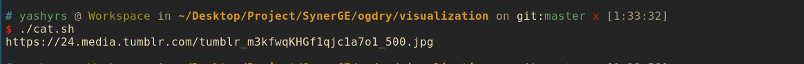
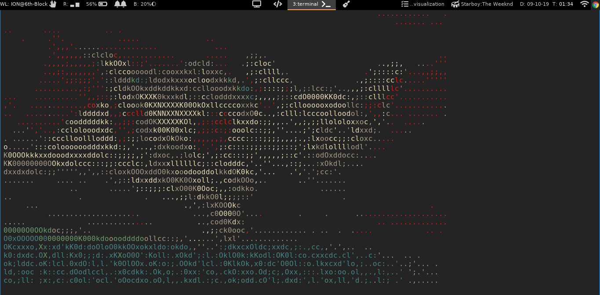

# TheCatAPI-Cli
Use http://TheCatAPI.com/ through a Linux Terminal

#Usage (As normal script)
```bash
wget https://raw.githubusercontent.com/AlphaT3ch/TheCatAPI-Cli/master/cat.sh
# Default Method; Returns cat URL
./cat.sh

# Ascii Method; Returns an ascii picture of a cat (requires [jp2a](https://github.com/AlphaT3ch/TheCatAPI-Cli/blob/master/jp2a.md))
./cat.sh --ascii
```

#Usage (Globally Throughout The System (Root Access Required))
```bash
wget -O - https://raw.githubusercontent.com/AlphaT3ch/TheCatAPI-Cli/master/global.sh | bash

# Usage
catpic

# Ascii Usage
catpic --ascii

# Custom Width Ascii
catpic --ascii 50

# Uninstaller
catpic --remove
```

#Common Errors
```bash
root@AlphaVPS:~# ./catpic --ascii
./catpic: line 4: jp2a: command not found
```
Resolution: [Install jp2a](https://github.com/AlphaT3ch/TheCatAPI-Cli/blob/master/jp2a.md)

```bash
root@AlphaVPS:~# ./catpic --ascii
root@AlphaVPS:~# Not a JPEG file: starts with 0x47 0x49
```
Resolution: Sadly, there is no resolution for this yet because [The Cat API](http://thecatapi.com/) isn't returning the called-for information


# Sample Output

## Normal execution without any arguments


## with --ascii option 
